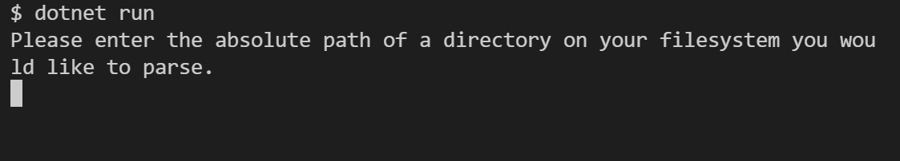

# Take Home Project

Challenge: A directory contains multiple files and directories of non-uniform file and directory names. Create a program that traverses a base directory and creates an index file that can be used to quickly lookup files by name, size, and content type.

# Usage

The solution for this take home project is implemented as a .Net Core console application. Thus, it can be run ideally cross platform on any OS (Windows, Linux).

## Prerequisites
1. The .Net Core CLI (version 5 is located here: https://dotnet.microsoft.com/en-us/download/dotnet/5.0)
2. A shell that can accept keyboard input from a user (e.g. bash, powershell).

## Steps to run
1. Clone this repository to your local machine.
2. Navigate to the repository base directory inside your shell of choice.
3. Run the 'dotnet run' command .
4. The console app should start up (screenshot below). Follow the instructions to run the project! Note, all input is expected to be delimited by a return character (e.g. the enter key).
